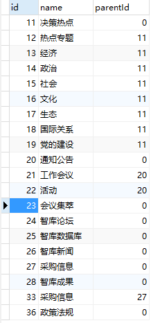

# 湖北智库网前后端接口文档

## 1、后台功能接口

### 1.1、用户管理

#### 1.1.1、新增用户

服务地址：/sys/user/add

请求方法：POST

请求参数：

| 参数   | 类型   | 是否必须 | 默认值  | 说明                  |
| ---- | ---- | ---- | ---- | ------------------- |
| type | int  | 否    | 0    | 用户类型0(后台用户),1(前端用户) |

请求body：

``` json
{
    "username": "小明",
  	"password": "123",
  	"roleId": 1
  	
}
```

请求成功：

```json
{
    "message": "添加成功",
    "status": 0,
    "result": {
        "id": 5,
        "username": "小明",
        "password": "123",
        "roleId": 1,
        "createTime": "2017-11-02 15:57:10",
      	"type": 0
    },
    "returnCode": null
}
```

#### 1.1.2、删除用户

服务地址：/sys/user/delete

请求方法：DELETE

请求参数：

| 参数   | 类型   | 是否必须 | 默认值  | 说明   |
| ---- | ---- | ---- | ---- | ---- |
| id   | int  | yes  |      | 用户ID |
|      |      |      |      |      |

请求成功：

```json
{
    "message": "删除成功",
    "status": 0,
    "result": {
        "id": 5,
        "username": "小明",
        "password": "123",
        "roleId": 1,
        "createTime": "2017-11-02 15:57:10",
      	"type": 1,
    },
    "returnCode": null
```

请求失败：

```json
{
    "message": "该用户不存在，删除失败",
    "status": -1,
    "result": null,
    "returnCode": null
}
```

#### 1.1.3、修改用户

服务地址：/sys/user/update

请求方法：PUT

请求body：

```json
{	
	"id": 4,
    "username": "小李",
    "password": "123",
    "roleId": 1,
  	"type": 0
}
```

请求成功：

```json
{
    "message": "修改成功",
    "status": 0,
    "result": {
        "id": 4,
        "username": "小李",
        "password": "123",
        "roleId": 1,
        "createTime": null,
      	"type": 0
    },
    "returnCode": null
}
```

修改失败：

```json
{
    "message": "修改失败，用户不存在",
    "status": -1,
    "result": null,
    "returnCode": null
}
```

#### 1.1.4、条件分页查询用户列表

服务地址：/sys/user/findAll

请求方法：GET

请求参数：

| 参数        | 类型     | 是否必须 | 默认值  | 说明   |
| --------- | ------ | ---- | ---- | ---- |
| index     | int    | 否    | 1    | 第几页  |
| size      | int    | 否    | 10   | 每页几条 |
| field     | String | 否    | ""   | 字段名  |
| keyword   | string | 否    | ""   | 字段值  |
| beginTime | date   | 否    | ""   | 开始时间 |
| endTime   | date   | 否    | ""   | 结束时间 |

请求成功：

```json
{
    "message": null,
    "status": 0,
    "result": {
        "content": [
            {
                "id": 1,
                "username": "小李",
                "password": "456",
                "roleId": 0,
                "createTime": null,
              	"type": 0
            },
            {
                "id": 2,
                "username": "张三",
                "password": "789",
                "roleId": 0,
                "createTime": null,
              	"type": 0
            },
            {
                "id": 3,
                "username": "小明",
                "password": "123",
                "roleId": 0,
                "createTime": null,
              	"type": 0
            }
        ],
        "last": true,
        "totalElements": 7,
        "totalPages": 1,
        "number": 0,
        "size": 10,
        "sort": null,
        "first": true,
        "numberOfElements": 7
    },
    "returnCode": null
}
```

请求失败：

```json
{
    "message": "查询用户列表失败",
    "status": -1,
    "result": null,
    "returnCode": null
}
```

#### 1.1.5、给用户指定角色

服务地址：/sys/user/updateAuthedUserRole

请求方法：POST

请求参数：

| 参数     | 类型   | 是否必须 | 默认值  | 说明   |
| ------ | ---- | ---- | ---- | ---- |
| userId | int  | 是    |      | 用户Id |
| roleId | int  | 是    |      | 角色Id |

请求成功：

```json
{
    "message": "修改成功",
    "status": 0,
    "result": {
        "id": 1,
        "userId": 1,
        "roleId": 1
    },
    "returnCode": null
}
```

### 1.2、角色管理

#### 1.2.1、新增角色

服务地址：/sys/role/add

请求方法：POST

请求body：

```json
{	
    "name": "编辑部经理",
    "note": "角色备注"
}
```

请求成功：

```json
{
    "message": "添加成功",
    "status": 0,
    "result": {
        "id": 3,
        "name": "编辑部经理",
        "note": "角色备注"
    },
    "returnCode": null
}
```

请求失败：

```json
{
    "message": "新增角色失败",
    "status": -1,
    "result": null,
    "returnCode": null
}
```

#### 1.2.2、删除角色

服务地址：/sys/role/delete

请求方法：DELETE

请求参数：

| 参数   | 类型   | 是否必须 | 默认值  | 说明   |
| ---- | ---- | ---- | ---- | ---- |
| id   | int  | 是    |      | 角色Id |

请求成功：

```json
{
    "message": "删除成功",
    "status": 0,
    "result": {
        "id": 3,
        "name": "编辑部经理",
        "note": "角色备注"
    },
    "returnCode": null
}
```

请求失败：

```json
{
    "message": "删除角色失败",
    "status": -1,
    "result": null,
    "returnCode": null
}
```

#### 1.2.3、修改角色

服务地址：/sys/role/update

请求方法：PUT

请求body：

```json
{	
	"id": 1,
	"name": "编辑部经理",
	"note": "角色备注"
}
```

请求成功：

```json
{
    "message": "修改成功",
    "status": 0,
    "result": {
        "id": 1,
        "name": "编辑部经理",
        "note": "角色备注"
    },
    "returnCode": null
}
```

请求失败：

```json
{
    "message": "修改失败，角色不存在",
    "status": -1,
    "result": null,
    "returnCode": null
}
```

#### 1.2.4、查询所有角色

服务地址：/sys/role/getAll

请求方法：GET

请求成功：

```json
{
    "message": "列表获取成功",
    "status": 0,
    "result": [
        {
            "id": 1,
            "name": "编辑部经理",
            "note": "角色备注"
        },
        {
            "id": 2,
            "name": "编辑部经理",
            "note": "备注"
        }
    ],
    "returnCode": null
}
```

请求失败：

```json
{
    "message": "获取角色列表异常",
    "status": -1,
    "result": null,
    "returnCode": null
}
```

#### 1.2.5、条件分页查询角色列表

服务地址：/sys/role/findAll

请求方法：GET

请求参数：

| 参数      | 类型     | 是否必须 | 默认值  | 说明   |
| ------- | ------ | ---- | ---- | ---- |
| index   | int    | 否    | 0    | 第几页  |
| size    | int    | 否    | 10   | 每页   |
| field   | string | 否    | ""   | 查询字段 |
| keyword | string | 否    | ""   | 查询值  |

请求成功：

```json
{
    "message": "查询角色成功",
    "status": 0,
    "result": {
        "content": [
            {
                "id": 1,
                "name": "编辑部经理",
                "note": "角色备注"
            },
            {
                "id": 2,
                "name": "编辑部经理",
                "note": "备注"
            }
        ],
        "last": true,
        "totalPages": 1,
        "totalElements": 2,
        "number": 0,
        "size": 10,
        "sort": null,
        "first": true,
        "numberOfElements": 2
    },
    "returnCode": null
}
```

请求失败：

```json
{
    "message": "获取角色列表异常",
    "status": -1,
    "result": null,
    "returnCode": null
}
```

### 1.3、机构管理

#### 1.3.1、新增机构

服务地址：/organization/add

请求方法：POST

请求body：

```json
{	
	"name": "机构名",
	"intro": "单位简介",
  	"lead": "领导名",
  	"institutionSetting": "机构设置",
  	"type": 0,
  	"shield": 0,
  	"territoryName": "武汉市",
  	"organizationType": 1
}
```

请求成功：

```json
{
    "message": "添加机构成功",
    "status": 0,
    "result": {
        "id": 4,
        "name": "机构名",
        "intro": "单位简介",
        "lead": "领导",
        "institutionSetting": "机构设置",
        "type": 0,
        "shield": 0
    },
    "returnCode": null
}
```

请求失败：

```json
{
    "message": "新增机构失败",
    "status": -1,
    "result": null,
    "returnCode": null
}
```

#### 1.3.2、删除机构

服务地址：/organization/delete

请求方法：DELETE

请求参数：

| 参数   | 类型   | 是否必须 | 默认值  | 说明   |
| ---- | ---- | ---- | ---- | ---- |
| id   | int  | 是    |      | 机构Id |

请求成功：

```json
{
    "message": "删除机构成功",
    "status": 0,
    "result": {
        "id": 3,
        "name": "安徽智库",
        "intro": "1",
        "lead": "领导",
        "institutionSetting": "1",
        "type": 1,
        "shield": 1
    },
    "returnCode": null
}
```

请求失败：

```json
{
    "message": "新增删除失败",
    "status": -1,
    "result": null,
    "returnCode": null
}
```

#### 1.3.3、修改机构

服务地址：/organization/update

请求方法：PUT

请求body：

```json
{	
	"id": 4,
	"name": "测试机构名",
	"intro": "测试单位简介",
  	"lead": "领导",
  	"institutionSetting": "测试机构设置",
  	"type": 0,
  	"shield": 0
}
```

请求成功：

```json
{
    "message": "修改机构成功",
    "status": 0,
    "result": {
        "id": 4,
        "name": "测试机构名",
        "intro": "测试单位简介",
        "lead": "领导",
        "institutionSetting": "测试机构设置",
        "type": 0,
        "shield": 0
    },
    "returnCode": null
}
```

请求失败：

```json
{
    "message": "修改机构失败",
    "status": -1,
    "result": null,
    "returnCode": null
}
```

#### 1.3.4、查询所有机构

服务地址：/organization/getAll

请求方法：GET

请求成功：

```json
{
    "message": "获取列表成功",
    "status": 0,
    "result": [
        {
            "id": 4,
            "name": "测试机构名",
            "intro": "测试单位简介",
            "lead": "领导",
            "institutionSetting": "测试机构设置",
            "type": 0,
            "shield": 0
        }
    ],
    "returnCode": null
}
```

请求失败：

```json
{
    "message": "获取机构列表失败",
    "status": -1,
    "result": null,
    "returnCode": null
}
```

#### 1.3.5、条件分页查询机构列表

服务地址：/organization/findAll

请求方法：GET

请求参数：

| 参数      | 类型     | 是否必须 | 默认值  | 说明   |
| ------- | ------ | ---- | ---- | ---- |
| index   | int    | 否    | 0    | 第几页  |
| size    | int    | 否    | 10   | 每页几个 |
| field   | string | 否    | ""   | 查询字段 |
| keyword | string | 否    | ""   | 查询值  |

请求成功：

```json
{
    "message": "机构列表查询成功",
    "status": 0,
    "result": {
        "content": [
            {
                "id": 4,
                "name": "测试机构名",
                "intro": "测试单位简介",
                "lead": "蒋光鼐",
                "institutionSetting": "测试机构设置",
                "type": 0,
                "shield": 0
            }
        ],
        "last": true,
        "totalElements": 1,
        "totalPages": 1,
        "number": 0,
        "size": 10,
        "sort": null,
        "first": true,
        "numberOfElements": 1
    },
    "returnCode": null
}
```

请求失败：

```json
{
    "message": "获取机构列表失败",
    "status": -1,
    "result": null,
    "returnCode": null
}
```

### 1.4、菜单管理

#### 1.4.1、获取菜单

服务地址：/sys/menu/findAll

请求方法：GET

请求成功：

```json
{
    "message": "菜单加载成功",
    "status": 0,
    "result": [
        {
            "id": 1,
            "name": "用户管理",
            "code": null,
            "menuId": -1,
            "list": []
        },
        {
            "id": 2,
            "name": "权限管理",
            "code": null,
            "menuId": -1,
            "list": []
        },
        {
            "id": 3,
            "name": "信息管理",
            "code": null,
            "menuId": -1,
            "list": [
                {
                    "id": 4,
                    "name": "智库新闻",
                    "code": null,
                    "menuId": 3,
                    "list": []
                },
                {
                    "id": 5,
                    "name": "决策热点管理",
                    "code": null,
                    "menuId": 3,
                    "list": []
                }
            ]
        }
    ],
    "returnCode": null
}
```

请求失败：

```
{
    "message": "菜单加载异常",
    "status": -1,
    "result": null,
    "returnCode": null
}
```

#### 1.4.2、编辑角色菜单

服务地址：/sys/menu/editRoleRight

请求方法：POST

请求参数：

| 参数     | 类型   | 是否必须 | 默认值  | 说明   |
| ------ | ---- | ---- | ---- | ---- |
| roleId | int  | 是    |      | 角色id |

请求body：

```json
[
  1,
  2
]
```

请求成功：

```json
{
    "message": "角色菜单设置成功",
    "status": 0,
    "result": true,
    "returnCode": null
}
```

请求失败：

```json
{
    "message": "编辑角色菜单异常",
    "status": -1,
    "result": null,
    "returnCode": null
}
```

### 1.5、后台用户登陆

#### 1.5.1、登陆

服务地址：sys/login

请求方法：POST

请求参数：

| 参数   | 类型   | 是否必须 | 默认值  | 说明                  |
| ---- | ---- | ---- | ---- | ------------------- |
| type | int  | 否    | 0    | 用户类型0(后台用户),1(前端用户) |

请求body：

```json
{
  "username": "小李",
  "password": "456"
}
```

请求成功：

```json
{
    "message": null,
    "status": 0,
    "result": {
        "id": 1,
        "username": "小李",
        "password": "456",
        "roleId": 0,
        "createTime": null
      	"type": 0
    },
    "returnCode": null
}
```

请求失败：

```json
{
    "message": "登陆失败",
    "status": -1,
    "result": null,
    "returnCode": null
}
```

### 1.6、专家学者管理

#### 1.6.1、新增专家

服务地址：/expert/add

请求方法：POST

请求body：

```json
{
	"img": "专家照片www.img.com",
	"name": "专家名",
	"position": "教授",
	"organizationId	": 1,
	"resume": "简历",
	"research": "研究领域",
	"educational": "背景教育",
	"report": "内部报告",
	"academicPaper": "学术论文",
	"composition": "著作",
	"researchProject": "研究项目",
	"partTimeJob": "兼职",
	"socialPrestige": "社会名誉",
	"researchResult": "成就",
	"contactWay": "联系方式",
  	"shield": 0
}
```

请求成功：

```json
{
    "message": "添加成功",
    "status": 0,
    "result": {
        "id": 2,
        "img": "专家照片www.img.com",
        "name": "专家名",
        "position": "教授",
        "organizationId": 1,
        "resume": "简历",
        "research": "研究领域",
        "educational": "背景教育",
        "report": "内部报告",
        "academicPaper": "学术论文",
        "composition": "著作",
        "researchProject": "研究项目",
        "partTimeJob": "兼职",
        "socialPrestige": "社会名誉",
        "researchResult": "成就",
        "contactWay": "联系方式",
      	"shield": 0
    },
    "returnCode": null
}
```

请求失败：

```json
{
    "message": "添加失败",
    "status": -1,
    "result": null,
    "returnCode": null
}
```


#### 1.6.2、删除专家

服务地址：/expert/delete

请求方法：DELETE

请求参数：

| 参数   | 类型   | 是否必须 | 默认值  | 说明   |
| ---- | ---- | ---- | ---- | ---- |
| id   | int  | yes  |      | 专家ID |

请求成功：

```json
{
    "message": "删除成功",
    "status": 0,
    "result": {
        "id": 1,
        "img": null,
        "name": "专家名",
        "position": "教授",
        "organizationId": 1,
        "resume": "简历",
        "research": "研究领域",
        "educational": "背景教育",
        "report": "内部报告",
        "academicPaper": "学术论文",
        "composition": "著作",
        "researchProject": "研究项目",
        "partTimeJob": "兼职",
        "socialPrestige": "社会名誉",
        "researchResult": "成就",
        "contactWay": "联系方式",
      	"shield": 1
    },
    "returnCode": null
}
```

请求失败：

```json
{
    "message": "专家不存在，删除失败",
    "status": -1,
    "result": null,
    "returnCode": null
}
```

#### 1.6.3、修改专家

服务地址：/expert/update

请求方法：PUT

请求body：

```json
{
	"id": 2,
	"img": "专家照片www.img.com",
	"name": "贺军翔",
	"position": "教授",
	"organizationId": 1,
	"resume": "简历",
	"research": "研究领域",
	"educational": "背景教育",
	"report": "内部报告",
	"academicPaper": "学术论文",
	"composition": "著作",
	"researchProject": "研究项目",
	"partTimeJob": "兼职",
	"socialPrestige": "社会名誉",
	"researchResult": "成就",
	"contactWay": "联系方式",
  	"shield": 1
}
```

请求成功：

```json
{
    "message": "修改成功",
    "status": 0,
    "result": {
        "id": 2,
        "img": "专家照片www.img.com",
        "name": "贺军翔",
        "position": "教授",
        "organizationId": 1,
        "resume": "简历",
        "research": "研究领域",
        "educational": "背景教育",
        "report": "内部报告",
        "academicPaper": "学术论文",
        "composition": "著作",
        "researchProject": "研究项目",
        "partTimeJob": "兼职",
        "socialPrestige": "社会名誉",
        "researchResult": "成就",
        "contactWay": "联系方式"
      	"shield": 0
    },
    "returnCode": null
}
```

修改失败：

```json
{
    "message": "该专家不存在，修改失败",
    "status": -1,
    "result": null,
    "returnCode": null
}
```

#### 1.6.4、查询所有专家

服务地址：/expert/getExpertAll

请求方法：GET

请求成功：

```json
{
    "message": "获取列表成功",
    "status": 0,
    "result": [
        {
           "id": 2,
                "img": "专家照片www.img.com",
                "name": "贺军翔",
                "position": "教授",
                "organizationId": 1,
                "resume": "简历",
                "research": "研究领域",
                "educational": "背景教育",
                "report": "内部报告",
                "academicPaper": "学术论文",
                "composition": "著作",
                "researchProject": "研究项目",
                "partTimeJob": "兼职",
                "socialPrestige": "社会名誉",
                "researchResult": "成就",
                "contactWay": "联系方式",
              	"shield": 0
        },
      {
                "id": 3,
                "img": "专家照片www.img.com",
                "name": "殷彩霞",
                "position": "教授",
                "organizationId": 1,
                "resume": "简历",
                "research": "研究领域",
                "educational": "背景教育",
                "report": "内部报告",
                "academicPaper": "学术论文",
                "composition": "著作",
                "researchProject": "研究项目",
                "partTimeJob": "兼职",
                "socialPrestige": "社会名誉",
                "researchResult": "成就",
                "contactWay": "联系方式",
              	"shield": 1
            }
    ],
    "returnCode": null
}
```

请求失败：

```json
{
    "message": "查询专家列表异常",
    "status": -1,
    "result": null,
    "returnCode": null
}
```

#### 1.6.5、条件分页查询所有专家

服务地址：/expert/findAll

请求方法：GET

请求参数：

| 参数      | 类型     | 是否必须 | 默认值  | 说明   |
| ------- | ------ | ---- | ---- | ---- |
| index   | int    | 否    | 1    | 第几页  |
| size    | int    | 否    | 10   | 每页几条 |
| field   | String | 否    | ""   | 字段名  |
| keyword | string | 否    | ""   | 字段值  |

请求成功：

```json
{
    "message": null,
    "status": 0,
    "result": {
        "content": [
            {
                "id": 2,
                "img": "专家照片www.img.com",
                "name": "贺军翔",
                "position": "教授",
                "organizationId": 1,
                "resume": "简历",
                "research": "研究领域",
                "educational": "背景教育",
                "report": "内部报告",
                "academicPaper": "学术论文",
                "composition": "著作",
                "researchProject": "研究项目",
                "partTimeJob": "兼职",
                "socialPrestige": "社会名誉",
                "researchResult": "成就",
                "contactWay": "联系方式"
            },
            {
                "id": 3,
                "img": "专家照片www.img.com",
                "name": "殷彩霞",
                "position": "教授",
                "organizationId": 1,
                "resume": "简历",
                "research": "研究领域",
                "educational": "背景教育",
                "report": "内部报告",
                "academicPaper": "学术论文",
                "composition": "著作",
                "researchProject": "研究项目",
                "partTimeJob": "兼职",
                "socialPrestige": "社会名誉",
                "researchResult": "成就",
                "contactWay": "联系方式"
            }
        ],
        "last": true,
        "totalElements": 2,
        "totalPages": 1,
        "number": 0,
        "size": 10,
        "sort": null,
        "first": true,
        "numberOfElements": 2
    },
    "returnCode": null
}
```

请求失败：

### 1.7、文章分类管理

#### 1.7.1、新增文章分类

服务地址：/articleSort/add

请求方法：POST

请求body：

```json
{	
	"name": "测试类型"
}
```

请求成功：

```json
{
    "message": "添加成功",
    "status": 0,
    "result": {
        "id": 30,
        "name": "测试类型",
        "parentId": 0
    },
    "returnCode": null
}
```

#### 1.7.2、删除文章分类

服务地址：/articleSort/delete

请求方法：DELETE

请求参数：

| 参数   | 类型   | 是否必须 | 默认值  | 说明     |
| ---- | ---- | ---- | ---- | ------ |
| id   | int  | yes  |      | 文章分类ID |

请求成功：

```json
{
    "message": "删除成功",
    "status": 0,
    "result": {
        "id": 31,
        "name": "测试类型",
        "parentId": 0
    },
    "returnCode": null
}
```

请求失败：

```json
{
    "message": "此分类下还有子级分类，请先删除子级类型",
    "status": -1,
    "result": null,
    "returnCode": null
}
```

#### 1.7.3、修改文章分类

服务地址：/articleSort/update

请求方法：PUT

请求body：

```json
{
	"id": 2,
	"name": "修改分类名",
	"parentId":1
}
```

请求成功：

```json
{
    "message": "修改成功",
    "status": 0,
    "result": {
        "id": 2,
        "name": "修改分类名",
        "parentId": 1
    },
    "returnCode": null
}
```

修改失败：

```json
{
    "message": "修改失败，分类不存在",
    "status": -1,
    "result": null,
    "returnCode": null
}
```

#### 1.7.4、无分页查询文章分类

服务地址：/articleSort/getArticleSort

请求方法：GET

请求参数：

| 参数       | 类型   | 是否必须 | 默认值  | 说明   |
| -------- | ---- | ---- | ---- | ---- |
| parentId | int  | 否    | 0    | 父级Id |

请求成功：

```json
{
    "message": null,
    "status": 0,
    "result": [
        {
            "id": 11,
            "name": "决策热点",
            "parentId": 0
        },
        {
            "id": 20,
            "name": "通知公告",
            "parentId": 0
        },
        {
            "id": 23,
            "name": "会议集萃",
            "parentId": 0
        }
    ],
    "returnCode": null
}
```

请求失败：

```json
{
    "message": "列表获取异常",
    "status": -1,
    "result": null,
    "returnCode": null
}
```

#### 1.7.5、条件分页查询文章分类列表

服务地址：/expert/findAll

请求方法：GET

请求参数：

| 参数       | 类型     | 是否必须 | 默认值  | 说明   |
| -------- | ------ | ---- | ---- | ---- |
| index    | int    | 否    | 1    | 第几页  |
| size     | int    | 否    | 10   | 每页几条 |
| field    | String | 否    | ""   | 字段名  |
| keyword  | string | 否    | ""   | 字段值  |
| parentId | int    | 否    | 0    | 父级Id |

请求成功：

```json
{
    "message": "获取文章列表成功",
    "status": 0,
    "result": {
        "content": [
            {
                "id": 11,
                "name": "决策热点",
                "parentId": 0
            },
            {
                "id": 20,
                "name": "通知公告",
                "parentId": 0
            },
            {
                "id": 23,
                "name": "会议集萃",
                "parentId": 0
            }
        ],
        "last": true,
        "totalPages": 1,
        "totalElements": 3,
        "number": 0,
        "size": 10,
        "sort": null,
        "first": true,
        "numberOfElements": 3
    },
    "returnCode": null
}
```

请求失败：

```json
{
    "message": "列表获取异常",
    "status": -1,
    "result": null,
    "returnCode": null
}
```

#### 1.7.6、获取所有的文章二级分类

服务地址：/articleSort/getJuniorAll

请求方法：GET

请求成功：

```json
{
    "message": null,
    "status": 0,
    "result": [
        {
            "id": 12,
            "name": "热点专题",
            "parentId": 11
        },
        {
            "id": 13,
            "name": "经济",
            "parentId": 11
        },
        {
            "id": 14,
            "name": "政治",
            "parentId": 11
        },
        {
            "id": 21,
            "name": "工作会议",
            "parentId": 20
        },
        {
            "id": 22,
            "name": "活动",
            "parentId": 20
        }
    ],
    "returnCode": null
}
```

请求失败：

```json
{
    "message": "获取文章二级分类异常",
    "status": -1,
    "result": null,
    "returnCode": null
}
```


### 1.8、文章管理

#### 1.8.1、新增文章

服务地址：/article/add

请求方法：POST

请求body：

```json
{
	"title": "文章标题",
	"author": "作者",
	"createdDate": "2017-10-10 10:10:10",
	"content": "文章内容",
	"imgUrl": "图片地址www.img.com",
	"imgState": "图片说明",
	"textTypeId": 11,
	"organizationId": 1,
  	"shield": 0
}
```

请求成功：

```json
{
    "message": "添加成功",
    "status": 0,
    "result": {
        "id": 11,
        "title": "文章标题",
        "author": "作者",
        "createdDate": "2017-10-10 10:10:10",
        "content": "文章内容",
        "imgUrl": "图片地址www.img.com",
        "imgState": "图片说明",
        "textTypeId": 1,
        "organizationId": 1,
        "addTime": "2017-11-04 15:54:33",
      	"shield": 0
    },
    "returnCode": null
}
```

请求失败：

```json
{
    "message": "添加失败",
    "status": -1,
    "result": null,
    "returnCode": null
}
```


#### 1.8.2、删除文章

服务地址：/article/delete

请求方法：DELETE

请求参数：

| 参数   | 类型   | 是否必须 | 默认值  | 说明   |
| ---- | ---- | ---- | ---- | ---- |
| id   | int  | yes  |      | 文章ID |

请求成功：

```json
{
    "message": "删除成功",
    "status": 0,
    "result": {
        "id": 11,
        "title": "文章标题",
        "author": "作者",
        "createdDate": "2017-10-10 10:10:10",
        "content": "文章内容",
        "imgUrl": "图片地址www.img.com",
        "imgState": "图片说明",
        "textTypeId": 1,
        "organizationId": 1,
        "addTime": "2017-11-04 15:54:33",
      	"shield": 0
    },
    "returnCode": null
}
```

请求失败：

```json
{
    "message": "删除失败,文章不存在",
    "status": -1,
    "result": null,
    "returnCode": null
}
```

#### 1.8.3、修改文章

服务地址：/article/update

请求方法：PUT

请求body：

```json
{
	"id": 10,
    "title": "文章标题",
    "author": "作者",
    "createdDate": "2017-10-10 10:10:10",
    "content": "文章内容",
    "imgUrl": "图片地址www.img.com",
    "imgState": "图片说明",
    "textTypeId": 1,
    "organizationId": 1,
    "addTime": "2017-11-04 15:54:33"
  	"shield": 0
}
```

请求成功：

```json
{
    "message": "修改成功",
    "status": 0,
    "result": {
        "id": 10,
        "title": "文章标题",
        "author": "作者",
        "createdDate": "2017-10-10 10:10:10",
        "content": "文章内容",
        "imgUrl": "图片地址www.img.com",
        "imgState": "图片说明",
        "textTypeId": 1,
        "organizationId": 1,
        "addTime": "2017-11-02 14:51:17",
      	"shield": 0
    },
    "returnCode": null
}
```

修改失败：

```json
{
    "message": "修改失败，文章不存在",
    "status": -1,
    "result": null,
    "returnCode": null
}
```

#### 1.8.4、条件分页查询文章

服务地址：/article/findAll

请求方法：GET

请求参数：

| 参数             | 类型     | 是否必须 | 默认值  | 说明     |
| -------------- | ------ | ---- | ---- | ------ |
| index          | int    | 否    | 0    | 第几页    |
| size           | int    | 否    | 10   | 每页     |
| field          | string | 否    | ""   | 查询字段   |
| keyword        | string | 否    | ""   | 查询值    |
| beginTime      | date   | 否    | ""   | 开始时间   |
| endTime        | date   | 否    | ""   | 结束时间   |
| typeId         | int    | 否    | 0    | 文章类型id |
| organizationId | int    | 否    | 0    | 机构id   |

请求成功：

```json
{
    "message": "获取列表成功",
    "status": 0,
    "result": {
        "content": [
            {
                "id": 7,
                "title": "新巴山轮会议2017,全球名家荟萃,究竟说了些什么大事?",
                "author": "人大重阳",
                "createdDate": "2017-10-10 10:10:10",
                "content": "10月28日-29日以“十九大后的中国与世界”为主题的中国经济与国际合作年会暨新“巴山轮”会议·2017在人民大学举行。本次会议由中国人民大学、新“巴山轮”论坛和国家发展改革委国际合作中心联合主办，中国人民大学国家发展与战略研究院和重阳金融研究院联合承办。论坛期间，数十位中外学者结合十九大报告和全球经济形势，就此进行了展望",
                "imgUrl": "www.wwwcd.com",
                "imgState": "图片说明",
                "textTypeId": 1,
                "organizationId": 1,
                "addTime": "2017-11-02 14:37:39",
              	"shield": 0
            },
            {
                "id": 8,
                "title": "畅谈外事礼仪,践行公共外交 ——《新编公务员外事礼仪》新书发布会在京举办",
                "author": "王琳互动",
                "createdDate": "2017-10-10 10:10:10",
                "content": "11月1日，由察哈尔学会主办的“一带一路”，礼仪之路——《新编公务员外事礼仪》新书发布会在北京举行。在中共十九大精神与“一带一路”倡议的感召下，中国人的涉外交往越来越多，既有中国人走出国门，也有外国人跨入国门。在日益增多的全球互动中，涉外礼仪发挥着越来越重要的作用。在对外交往中，人是最生动的一张名片，代表着国家，也承载着文化。古人云：“人无礼则不生，事无礼则不成，国家无礼则不宁。”公务员在外事交往中代表着中国政府的形象，代表着中国的国家形象，因此公务员外事礼仪的研究和推广显得尤为重要。",
                "imgUrl": "www.wwwcd.com",
                "imgState": "图片说明",
                "textTypeId": 1,
                "organizationId": 1,
                "addTime": "2017-11-02 14:46:54",
              	"shield": 0
            },
            {
                "id": 9,
                "title": "马克思主义财经科学研究室日前启动",
                "author": "王琳互动",
                "createdDate": "2017-10-10 10:10:10",
                "content": "马克思主义财经科学发展论坛（2017）——“十九大”重大财经理论与改革创新研讨会暨马克思主义财经科学研究室启动会，于2017年10月31日下午在中国社会科学院财经战略研究院（以下简称“财经院”）成功举行。为巩固与壮大马克思主义研究阵地，中国社会科学院财经战略研究院特成立马克思主义财经科学研究室，研究室将每年举办“马克思主义财经科学发展论坛”。首届马克思主义财经科学发展论坛在“十九大”圆满闭幕后及时召开，致力于在第一时间为学者研究和阐释十九大报告中的重大财经理论与改革创新成果搭建一个学术探讨的平台。",
                "imgUrl": "www.wwwcd.com",
                "imgState": "图片说明",
                "textTypeId": 1,
                "organizationId": 1,
                "addTime": "2017-11-02 14:47:55",
              	"shield": 0
            },
            {
                "id": 10,
                "title": "文章标题",
                "author": "作者",
                "createdDate": "2017-10-10 10:10:10",
                "content": "文章内容",
                "imgUrl": "图片地址www.img.com",
                "imgState": "图片说明",
                "textTypeId": 1,
                "organizationId": 1,
                "addTime": "2017-11-02 14:51:17",
              	"shield": 0
            }
        ],
        "last": true,
        "totalPages": 1,
        "totalElements": 4,
        "number": 0,
        "size": 10,
        "sort": null,
        "first": true,
        "numberOfElements": 4
    },
    "returnCode": null
}
```

请求失败：

```json
{
    "message": "文章列表查询异常",
    "status": -1,
    "result": null,
    "returnCode": null
}
```

### 1.9、站内搜索

#### 1.9.1、分页复合查询

服务地址：/query/zk/article

请求方法：GET

请求参数：

| 参数        | 类型     | 是否必须 | 默认值  | 说明   |
| --------- | ------ | ---- | ---- | ---- |
| query     | string | 否    | ""   | 查询内容 |
| pageIndex | int    | 否    | 0    | 第几页  |
| pageSize  | int    | 否    | 10   | 每页几条 |

例如：http://localhost:8080/query/zk/article?query=全球名家

请求成功：

```json
{
    "message": "获取列表成功",
    "status": 0,
    "result": [
        {
            "id": 7,
            "title": "新巴山轮会议2017,<span style=\"color:red\">全球</span><span style=\"color:red\">名家</span>荟萃,究竟说了些什么大事?",
            "author": "人大重阳",
            "createdDate": null,
            "content": "，中国人民大学国家发展与战略研究院和重阳金融研究院联合承办。论坛期间，数十位中外学者结合十九大报告和<span style=\"color:red\">全球</span>经济形势，就此进行了展望",
            "imgUrl": null,
            "imgState": null,
            "textTypeId": 0,
            "organizationId": 0,
            "addTime": null
        },
        {
            "id": 8,
            "title": "畅谈外事礼仪,践行公共外交 ——《新编公务员外事礼仪》新书发布会在京举办",
            "author": "王琳互动",
            "createdDate": null,
            "content": "外国人跨入国门。在日益增多的<span style=\"color:red\">全球</span>互动中，涉外礼仪发挥着越来越重要的作用。在对外交往中，人是最生动的一张名片，代表着国家，也承载着文化。古人云：“人无礼则不生，事无礼则不成，国家无礼则不宁。”公务员在外事交往中代表着中国政府的形象，代表着中国的国家形象，因此公务员外事礼仪的研究和推广显得尤为重要。",
            "imgUrl": null,
            "imgState": null,
            "textTypeId": 0,
            "organizationId": 0,
            "addTime": null
        }
    ],
    "returnCode": null
}
```

请求失败：

```json
{
    "message": "站内搜索异常",
    "status": -1,
    "result": null,
    "returnCode": null
}
```

### 1.10、索引库接口

#### 1.10.1、创键索引

服务地址：/es/addIndex

请求方法：POST

说明：设置的默认索引名为"zk"

请求成功：

```json
{
    "message": "创建成功",
    "status": 0,
    "result": null,
    "returnCode": null
}
```

请求失败：

```json
{
    "message": "创建失败",
    "status": -1,
    "result": null,
    "returnCode": null
}
```


#### 1.10.2、创建类型

服务地址：/es/addMapping

请求方法：POST

说明：设置的默认类型名为"article"

请求成功：

```json
{
    "message": "创建成功",
    "status": 0,
    "result": null,
    "returnCode": null
}
```

请求失败：

```json
{
    "message": "创建失败",
    "status": -1,
    "result": null,
    "returnCode": null
}
```

### 1.11、首页头部图片展示管理

#### 1.8.1、新增展示图片

服务地址：/titleImg/add

请求方法：POST

请求body：

```json
{
	"imgUrl": "www.imgUrl.com",
	"addTime": "2017-10-10 10:10:10",
	"state": 1
}
```

请求成功：

```json
{
    "message": "添加成功",
    "status": 0,
    "result": {
        "id": 1,
        "imgUrl": "www.imgUrl.com",
        "addTime": "2017-10-10 10:10:10",
        "state": 1
    },
    "returnCode": null
}
```

请求失败：

```json
{
    "message": "添加失败",
    "status": -1,
    "result": null,
    "returnCode": null
}
```


#### 1.8.2、删除展示图片

服务地址：/titleImg/delete

请求方法：DELETE

请求参数：

| 参数   | 类型   | 是否必须 | 默认值  | 说明     |
| ---- | ---- | ---- | ---- | ------ |
| id   | int  | yes  |      | 展示图片ID |

请求成功：

```json
{
    "message": "删除成功",
    "status": 0,
    "result": {
        "id": 1,
        "imgUrl": "www.imgUrl.com",
        "addTime": "2017-10-10 10:10:10",
        "state": 1
    },
    "returnCode": null
}
```

请求失败：

```json
{
    "message": "删除失败,图片不存在",
    "status": -1,
    "result": null,
    "returnCode": null
}
```

#### 1.8.3、更换图片

服务地址：/titleImg/update

请求方法：PUT

请求body：

```json
{
	"id": 1,
    "imgUrl": "www.imgUrl.com",
    "addTime": "2017-11-11 11:11:11",
    "state": 0
}
```

请求成功：

```json
{
    "message": "修改成功",
    "status": 0,
    "result": {
        "id": 1,
        "imgUrl": "www.imgUrl.com",
        "addTime": "2017-11-11 11:11:11",
        "state": 0
    },
    "returnCode": null
}
```

修改失败：

```json
{
    "message": "修改失败，图片不存在",
    "status": -1,
    "result": null,
    "returnCode": null
}
```

#### 1.8.4、条件分页查询展示图片

服务地址：/titleImg/findAll

请求方法：GET

请求参数：

| 参数        | 类型   | 是否必须 | 默认值  | 说明   |
| --------- | ---- | ---- | ---- | ---- |
| index     | int  | 否    | 0    | 第几页  |
| size      | int  | 否    | 10   | 每页   |
| beginTime | date | 否    | ""   | 开始时间 |
| endTime   | date | 否    | ""   | 结束时间 |

请求成功：

```json
{
    "message": null,
    "status": 0,
    "result": {
        "content": [
            {
                "id": 1,
                "imgUrl": "www.img.com",
                "addTime": "2017-11-08 10:45:56",
                "state": 1
            },
            {
                "id": 2,
                "imgUrl": "图片地址www.img.com",
                "addTime": "2017-11-08 10:47:38",
                "state": 0
            }
        ],
        "last": true,
        "totalPages": 1,
        "totalElements": 2,
        "number": 0,
        "size": 10,
        "sort": null,
        "first": true,
        "numberOfElements": 2
    },
    "returnCode": null
}
```

请求失败：

```json
{
    "message": "查询展示图片列表异常",
    "status": -1,
    "result": null,
    "returnCode": null
}
```

### 1.12、文件上传

#### 1.12.1、保存上传的文件

服务地址：resource/upload

请求方法：POST

请求参数：

| 参数   | 类型   | 是否必须 | 默认值  | 说明              |
| ---- | ---- | ---- | ---- | --------------- |
| type | int  | 是    |      | 0(图片上传)，1(视频上传) |

请求body：

| 参数   | 类型            | 说明    |
| ---- | ------------- | ----- |
| file | MultipartFile | 上传的文件 |

请求成功：

```json
{
    "message": null,
    "status": 0,
    "result": "http://192.168.100.172/img/2017-11-16/e5efaffa4a1d448183e0cd0a0031ee26.jpg",
    "returnCode": null
}
```

请求失败：

```json
{
    "message": "文件上传失败",
    "status": -1,
    "result": null,
    "returnCode": null
}
```

#### 1.12.2、删除上传的文件

服务地址：resource/delete

请求方法：DELETE

请求参数：

| 参数           | 类型     | 是否必须 | 默认值  | 说明   |
| ------------ | ------ | ---- | ---- | ---- |
| fullFilePath | String | 是    |      | 文件路径 |

### 1.13、数据库管理

#### 1.13.1、数据库备份

服务地址：data/backup

请求方法：POST

请求成功：

```json
{
    "message": "数据库备份成功",
    "status": 0,
    "result": true,
    "returnCode": null
}
```

请求失败：

```json
{
    "message": "数据库备份失败",
    "status": -1,
    "result": null,
    "returnCode": null
}
```

#### 1.13.2、数据库还原

服务地址：data/recover

请求方法：POST

请求成功：

```json
{
    "message": "数据库恢复成功",
    "status": 0,
    "result": true,
    "returnCode": null
}
```

请求失败：

```json
{
    "message": "数据库恢复失败",
    "status": -1,
    "result": null,
    "returnCode": null
}
```

### 1.14、地域列表

服务地址：/territory/findAll

请求方法：GET

请求成功：

```json
{
    "message": null,
    "status": 0,
    "result": [
        {
            "id": 1,
            "name": "武汉市"
        },
        {
            "id": 2,
            "name": "仙桃市"
        },
        {
            "id": 3,
            "name": "十堰市"
        },
        {
            "id": 4,
            "name": "咸宁市"
        },
        {
            "id": 5,
            "name": "天门市"
        },
        {
            "id": 6,
            "name": "孝感市"
        },
        {
            "id": 7,
            "name": "宜昌市"
        },
        {
            "id": 8,
            "name": "恩施土家族苗族自治州"
        },
        {
            "id": 9,
            "name": "潜江市"
        },
        {
            "id": 10,
            "name": "神农架林区"
        },
        {
            "id": 11,
            "name": "荆州市"
        },
        {
            "id": 12,
            "name": "荆门市"
        },
        {
            "id": 13,
            "name": "襄樊市"
        },
        {
            "id": 14,
            "name": "鄂州市"
        },
        {
            "id": 15,
            "name": "随州市"
        },
        {
            "id": 16,
            "name": "黄冈市"
        },
        {
            "id": 17,
            "name": "黄石市"
        }
    ],
    "returnCode": null
}
```

请求失败：

```json
{
    "message": "地域列表查询异常",
    "status": -1,
    "result": null,
    "returnCode": null
}
```

### 1.15、音视频管理

#### 1.15.1、新增音视频

服务地址：/videoNews/add

请求方法：POST

请求body：

```json
{	
	"title": "视频新闻",
	"content": "单位简介的撒发啊发多少",
  	"videoUrl": "/video/2017-11-29/6888a28f5fcb7ccf4bcd6c5b38b2706c.mp4",
  	"shield": 1,
  	"organizationId": 0
}
```

请求成功：

```json
{
    "message": "新增成功",
    "status": 0,
    "result": {
        "id": 7,
        "title": "视频新闻",
        "content": "单位简介的撒发啊发多少",
        "videoUrl": "video/2017-11-29/6888a28f5fcb7ccf4bcd6c5b38b2706c.mp4",
        "createTime": null,
        "shield": 1,
        "organizationId": 0
    },
    "returnCode": null
}
```

请求失败：

```json
{
    "message": "新增视频资讯异常",
    "status": -1,
    "result": null,
    "returnCode": null
}
```


#### 1.15.2、删除音视频

服务地址：/videoNews/delete

请求方法：DELETE

请求参数：

| 参数   | 类型   | 是否必须 | 默认值  | 说明    |
| ---- | ---- | ---- | ---- | ----- |
| id   | int  | 是    |      | 音视频id |

请求成功：

```json
{
    "message": "删除成功",
    "status": 0,
    "result": {
        "id": 7,
        "title": "视频新闻",
        "content": "单位简介的撒发啊发多少",
        "videoUrl": "http://192.168.100.188/video/2017-11-29/6888a28f5fcb7ccf4bcd6c5b38b2706c.mp4",
        "createTime": null,
        "shield": 1,
        "organizationId": 0
    },
    "returnCode": null
}
```

请求失败：

```json
{
    "message": "删除视频资讯异常",
    "status": -1,
    "result": null,
    "returnCode": null
}
```

#### 1.15.3、修改音视频

服务地址：/videoNews/update

请求方法：PUT

请求body：

```json
{	
		"id": 7,
        "title": "视频新闻资讯",
        "content": "单位简介的撒发啊发多少",
        "videoUrl": "/video/2017-11-29/6888a28f5fcb7ccf4bcd6c5b38b2706c.mp4",
        "createTime": null,
        "shield": 1,
        "organizationId": 0
}
```

请求成功：

```json
{
    "message": "删除成功",
    "status": 0,
    "result": {
        "id": 7,
        "title": "视频新闻资讯",
        "content": "单位简介的撒发啊发多少",
        "videoUrl": "/video/2017-11-29/6888a28f5fcb7ccf4bcd6c5b38b2706c.mp4",
        "createTime": null,
        "shield": 1,
        "organizationId": 0
    },
    "returnCode": null
}
```

请求失败：

```json
{
    "message": "修改视频资讯异常",
    "status": -1,
    "result": null,
    "returnCode": null
}
```


#### 1.15.4、分页查询音视频列表

服务地址：/videoNews/findAll

请求方法：GET

| 参数        | 类型     | 是否必须 | 默认值  | 说明   |
| --------- | ------ | ---- | ---- | ---- |
| index     | int    | 否    | 0    | 第几页  |
| size      | int    | 否    | 10   | 每页几条 |
| field     | String | 否    | ""   | 查询字段 |
| keyword   | String | 否    | ""   | 查询值  |
| beginTime | date   | 否    | ""   | 开始时间 |
| endTime   | date   | 否    | ""   | 结束时间 |

请求成功：

```josn
{
    "message": null,
    "status": 0,
    "result": {
        "content": [
            {
                "id": 4,
                "title": "视频资讯",
                "content": "afafawf",
                "videoUrl": "/video/2017-11-29/6888a28f5fcb7ccf4bcd6c5b38b2706c.mp4",
                "createTime": "2017-11-09 18:31:23",
                "shield": 0,
                "organizationId": 6
            },
            {
                "id": 5,
                "title": "sfsf",
                "content": "efsf",
                "videoUrl": "wweww",
                "createTime": "2017-11-09 18:21:34",
                "shield": 1,
                "organizationId": 6
            },
            {
                "id": 6,
                "title": "测试",
                "content": "测试",
                "videoUrl": "www.cese",
                "createTime": "2017-11-09 18:23:35",
                "shield": 0,
                "organizationId": 6
            },
            {
                "id": 8,
                "title": "视频新闻",
                "content": "单位简介的撒发啊发多少",
                "videoUrl": "/video/2017-11-29/6888a28f5fcb7ccf4bcd6c5b38b2706c.mp4",
                "createTime": "2017-11-30 17:04:13",
                "shield": 1,
                "organizationId": 0
            }
        ],
        "totalPages": 1,
        "totalElements": 4,
        "last": true,
        "number": 0,
        "size": 10,
        "sort": null,
        "first": true,
        "numberOfElements": 4
    },
    "returnCode": null
}
```

请求失败：

```json
{
    "message": "查询视频资讯列表异常",
    "status": -1,
    "result": null,
    "returnCode": null
}
```

### 1.16、合作单位管理

注:  "type":  0(共建机构),1(友情链接),2(合作媒体),3(特别成员单位)

#### 1.16.1、新增合作单位

服务地址：/blogroll/add

请求方法：POST

请求body：

```json
{	
	"name": "中共中央党校",
	"imgUrl": "http://47.104.8.66/img/2017-12-10/c9642b0f42774d8cb8572826e944ca52.jpg",
  	"linkurl": "http://www.ccps.gov.cn/",
  	"type": 1,
  	"note": "备注"
}
```

请求成功：

```json
{
    "message": "添加成功",
    "status": 0,
    "result": {
        "id": 1,
        "name": "中共中央党校",
        "imgUrl": "http://47.104.8.66/img/2017-12-10/c9642b0f42774d8cb8572826e944ca52.jpg",
        "linkurl": "http://www.ccps.gov.cn/",
        "type": 1,
        "note": "备注"
    },
    "returnCode": null
}
```

请求失败：

```json
{
    "message": "合作单位新增异常",
    "status": -1,
    "result": null,
    "returnCode": null
}
```


#### 1.15.2、删除合作单位

服务地址：/blogroll/delete

请求方法：DELETE

请求参数：

| 参数   | 类型   | 是否必须 | 默认值  | 说明     |
| ---- | ---- | ---- | ---- | ------ |
| id   | int  | 是    |      | 合作单位id |

请求成功：

```json
{
    "message": "删除成功",
    "status": 0,
    "result": {
        "id": 2,
        "name": "国家行政学院",
        "imgUrl": "http://47.104.8.66/img/2017-12-10/c9642b0f42774d8cb8572826e944ca52.jpg",
        "linkurl": "http://www.ccps.gov.cn/",
        "type": 1,
        "note": "备注"
    },
    "returnCode": null
}
```

请求失败：

```json
{
    "message": "删除合作单位异常",
    "status": -1,
    "result": null,
    "returnCode": null
}
```

#### 1.15.3、修改合作单位

服务地址：/blogroll/update

请求方法：PUT

请求body：

```json
{	
	"id": 1,
	"name": "国家行政学院",
	"imgUrl": "http://47.104.8.66/img/2017-12-10/c9642b0f42774d8cb8572826e944ca52.jpg",
  	"linkurl": "http://www.ccps.gov.cn/",
  	"type": 1,
  	"note": "备注"
}
```

请求成功：

```json
{
    "message": "修改成功",
    "status": 0,
    "result": {
        "id": 1,
        "name": "国家行政学院",
        "imgUrl": "http://47.104.8.66/img/2017-12-10/c9642b0f42774d8cb8572826e944ca52.jpg",
        "linkurl": "http://www.ccps.gov.cn/",
        "type": 1,
        "note": "备注"
    },
    "returnCode": null
}
```

请求失败：

```json
{
    "message": "修改合作单位异常",
    "status": -1,
    "result": null,
    "returnCode": null
}
```


#### 1.15.4、分页查询合作单位列表

服务地址：/blogroll/findAll

请求方法：GET

| 参数      | 类型     | 是否必须 | 默认值  | 说明   |
| ------- | ------ | ---- | ---- | ---- |
| index   | int    | 否    | 0    | 第几页  |
| size    | int    | 否    | 10   | 每页几条 |
| field   | String | 否    | ""   | 查询字段 |
| keyword | String | 否    | ""   | 查询值  |

请求成功：

```josn
{
    "message": "获取列表成功",
    "status": 0,
    "result": {
        "content": [
            {
                "id": 1,
                "name": "中共中央党校",
                "imgUrl": "http://47.104.8.66/img/2017-12-10/c9642b0f42774d8cb8572826e944ca52.jpg",
                "linkurl": "http://www.ccps.gov.cn/",
                "type": 1,
                "note": "备注"
            },
            {
                "id": 3,
                "name": "国家行政学院",
                "imgUrl": "http://47.104.8.66/img/2017-12-10/c9642b0f42774d8cb8572826e944ca52.jpg",
                "linkurl": "http://www.ccps.gov.cn/",
                "type": 1,
                "note": "备注"
            }
        ],
        "last": true,
        "totalPages": 1,
        "totalElements": 2,
        "number": 0,
        "size": 10,
        "first": true,
        "sort": null,
        "numberOfElements": 2
    },
    "returnCode": null
}
```

请求失败：

```json
{
    "message": "合作单位列表查询异常",
    "status": -1,
    "result": null,
    "returnCode": null
}
```

### 

## 2、前端功能接口

### 注：textTypeId类型



### 2.1、智库首页

#### 2.1.1、获取首页头部展示图片

服务地址：/titleImg/findByState

请求方法：GET

请求成功：

```json
{
    "message": null,
    "status": 0,
    "result": [
        {
            "id": 1,
            "imgUrl": "www.img.com",
            "addTime": "2017-11-08 10:45:56",
            "state": 1
        }
    ],
    "returnCode": null
}
```

请求失败：

```json
{
    "message": "获取展示图片异常",
    "status": -1,
    "result": null,
    "returnCode": null
}
```

#### ~~2.1.2、注册用户~~

服务地址：/frontEnd/registeredUser

请求方法：POST

请求参数：

| 参数   | 类型   | 是否必须 | 默认值  | 说明                  |
| ---- | ---- | ---- | ---- | ------------------- |
| type | int  | 否    | 1    | 用户类型0(后台用户),1(前端用户) |

请求body:

```json
{
  "username": "小明",
  "password": "123"
}
```

请求成功：

```json
{
    "message": "注册成功",
    "status": 0,
    "result": {
        "id": 34,
        "username": "小明",
        "password": "123",
        "roleId": 0,
        "createTime": "2017-11-27 16:37:25",
        "type": 1
    },
    "returnCode": null
}
```

请求失败：

```json
{
    "message": "注册用户异常",
    "status": -1,
    "result": null,
    "returnCode": null
}
```

#### ~~2.1.3、前端用户登录~~

服务地址：/login

请求方法：POST

请求参数：

| 参数   | 类型   | 是否必须 | 默认值  | 说明                  |
| ---- | ---- | ---- | ---- | ------------------- |
| type | int  | 否    | 1    | 用户类型0(后台用户),1(前端用户) |

请求body:

```json
{
  "username": "小明",
  "password": "123"
}
```

请求成功：

```json
{
    "message": "登陆成功",
    "status": 0,
    "result": {
        "id": 34,
        "username": "小明",
        "password": "123",
        "roleId": 0,
        "createTime": "2017-11-27 16:37:25",
        "type": 1
    },
    "returnCode": null
}
```

请求失败：

```json
{
    "message": "登录异常",
    "status": -1,
    "result": null,
    "returnCode": null
}
```

#### 2.1.4、站内搜索

服务地址：/query/zk/article

请求方法：GET

请求参数：

| 参数        | 类型     | 是否必须 | 默认值  | 说明   |
| --------- | ------ | ---- | ---- | ---- |
| query     | string | 否    | ""   | 查询内容 |
| pageIndex | int    | 否    | 0    | 第几页  |
| pageSize  | int    | 否    | 10   | 每页几条 |

例如：http://localhost:8080/query/zk/article?query=全球名家

请求成功：

```json
{
    "message": "获取列表成功",
    "status": 0,
    "result": [
        {
            "id": 7,
            "title": "新巴山轮会议2017,<span style=\"color:red\">全球</span><span style=\"color:red\">名家</span>荟萃,究竟说了些什么大事?",
            "author": "人大重阳",
            "createdDate": null,
            "content": "，中国人民大学国家发展与战略研究院和重阳金融研究院联合承办。论坛期间，数十位中外学者结合十九大报告和<span style=\"color:red\">全球</span>经济形势，就此进行了展望",
            "imgUrl": null,
            "imgState": null,
            "textTypeId": 0,
            "organizationId": 0,
            "addTime": null
        },
        {
            "id": 8,
            "title": "畅谈外事礼仪,践行公共外交 ——《新编公务员外事礼仪》新书发布会在京举办",
            "author": "王琳互动",
            "createdDate": null,
            "content": "外国人跨入国门。在日益增多的<span style=\"color:red\">全球</span>互动中，涉外礼仪发挥着越来越重要的作用。在对外交往中，人是最生动的一张名片，代表着国家，也承载着文化。古人云：“人无礼则不生，事无礼则不成，国家无礼则不宁。”公务员在外事交往中代表着中国政府的形象，代表着中国的国家形象，因此公务员外事礼仪的研究和推广显得尤为重要。",
            "imgUrl": null,
            "imgState": null,
            "textTypeId": 0,
            "organizationId": 0,
            "addTime": null
        }
    ],
    "returnCode": null
}
```

请求失败：

```json
{
    "message": "站内搜索异常",
    "status": -1,
    "result": null,
    "returnCode": null
}
```

#### 2.1.5、获取轮播图展示的文章

服务地址：/frontEnd/getRecommendArticle

请求方法：GET

请求参数：

| 参数        | 类型   | 是否必须 | 默认值  | 说明                |
| --------- | ---- | ---- | ---- | ----------------- |
| recommend | int  | 否    | 1    | 是否推荐文章 0(否)， 1(是) |
| index     | int  | 否    | 0    | 第几页               |
| size      | int  | 否    | 5    | 每页几个              |

请求成功：

```json
{
    "message": null,
    "status": 0,
    "result": [
        {
            "id": 27,
            "title": "额外人",
            "author": "俄方",
            "createdDate": null,
            "content": "<p>微风日本风格和你</p>",
            "imgUrl": "",
            "imgState": "如果",
            "textTypeId": 12,
            "organizationId": 6,
            "addTime": "2017-11-17 15:49:26",
            "shield": 0,
            "recommend": 1
        },
        {
            "id": 30,
            "title": "ghu",
            "author": "ghjk",
            "createdDate": null,
            "content": "<p>bnm,./</p>",
            "imgUrl": "",
            "imgState": "ghjk",
            "textTypeId": 18,
            "organizationId": 6,
            "addTime": "2016-11-20 17:18:18",
            "shield": 0,
            "recommend": 1
        }
    ],
    "returnCode": null
}
```

请求失败：

```json
{
    "message": "获取推荐文章异常",
    "status": -1,
    "result": null,
    "returnCode": null
}
```

#### 2.1.6、获取优选资讯

服务地址：frontEnd/article

请求方法：GET

请求参数：

| 参数         | 类型   | 是否必须 | 默认值  | 说明   |
| ---------- | ---- | ---- | ---- | ---- |
| textTypeId | int  | 是    |      | 文章类型 |
| index      | int  | 否    | 0    | 第几页  |
| size       | int  | 否    | 6    | 每页几条 |

请求成功：

```json
{
    "message": null,
    "status": 0,
    "result": [
        {
            "id": 7,
            "title": "新巴山轮会议2017,全球名家荟萃,究竟说了些什么大事?",
            "author": "人大重阳",
            "createdDate": "2017-10-10 10:10:10",
            "content": "10月28日-29日以“十九大后的中国与世界”为主题的中国经济与国际合作年会暨新“巴山轮”会议·2017在人民大学举行。本次会议由中国人民大学、新“巴山轮”论坛和国家发展改革委国际合作中心联合主办，中国人民大学国家发展与战略研究院和重阳金融研究院联合承办。论坛期间，数十位中外学者结合十九大报告和全球经济形势，就此进行了展望",
            "imgUrl": "www.wwwcd.com",
            "imgState": "图片说明",
            "textTypeId": 10,
            "organizationId": 1,
            "addTime": "2017-11-02 14:37:39"
          	"shield": 0
        }
    ],
    "returnCode": null
}
```

请求失败：

```json
{
    "message": "首页文章显示异常",
    "status": -1,
    "result": null,
    "returnCode": null
}
```

#### ~~2.1.7、获取视频资讯~~

服务地址：frontEnd/findVideoNews

请求方法：GET

请求参数：

| 参数    | 类型   | 是否必须 | 默认值  | 说明   |
| ----- | ---- | ---- | ---- | ---- |
| index | int  | 否    | 0    | 第几页  |
| size  | int  | 否    | 1    | 每页几条 |

请求成功：

```json
{
    "message": null,
    "status": 0,
    "result": [
        {
            "id": 4,
            "title": "视频资讯",
            "content": "测试",
            "videoUrl": "测试",
            "createTime": null,
          	"shield": 0
        }
    ],
    "returnCode": null
}
```

请求失败：

```json
{
    "message": "视频新闻获取异常",
    "status": -1,
    "result": null,
    "returnCode": null
}
```

#### 2.1.8、获取视频列表

服务地址：frontEnd/findVideoNews

请求方法：GET

请求参数：

| 参数    | 类型   | 是否必须 | 默认值  | 说明   |
| ----- | ---- | ---- | ---- | ---- |
| index | int  | 否    | 0    | 第几页  |
| size  | int  | 否    | 1    | 每页几条 |

例：frontEnd/findVideoNews?index=0&size=10

请求成功：

```json
{
    "message": null,
    "status": 0,
    "result": [
        {
            "id": 4,
            "title": "视频资讯",
            "content": "测试",
            "videoUrl": "测试",
            "createTime": null,
          	"shield": 0
        }
    ],
    "returnCode": null
}
```

请求失败：

```json
{
    "message": "视频新闻获取异常",
    "status": -1,
    "result": null,
    "returnCode": null
}
```

#### 2.1.9、获取视频详情

服务地址：frontEnd/getVideoDetails

请求方法：GET

请求参数：

| 参数   | 类型   | 是否必须 | 默认值  | 说明   |
| ---- | ---- | ---- | ---- | ---- |
| id   | int  | 是    |      | 视频id |

请求成功：

```json
{
    "message": null,
    "status": 0,
    "result": [
        {
            "id": 4,
            "title": "视频资讯",
            "content": "测试",
            "videoUrl": "测试",
            "createTime": null,
          	"shield": 0
        }
    ],
    "returnCode": null
}
```

请求失败：

```json
{
    "message": "视频新闻获取异常",
    "status": -1,
    "result": null,
    "returnCode": null
}
```

#### 

### 2.2、决策热点

#### 2.2.1、获取二级分类

服务地址：articleSort/getArticleSonSort

请求方法：GET

请求参数：

| 参数       | 类型   | 是否必须 | 默认值  | 说明     |
| -------- | ---- | ---- | ---- | ------ |
| parentId | int  | 否    | 0    | 文章父级类型 |

例:/articleSort/getArticleSonSort?parentId=11

请求成功：

```json
{
    "message": null,
    "status": 0,
    "result": [
        {
            "id": 12,
            "name": "热点专题",
            "parentId": 11
        },
        {
            "id": 13,
            "name": "经济",
            "parentId": 11
        },
        {
            "id": 14,
            "name": "政治",
            "parentId": 11
        }
    ],
    "returnCode": null
}
```

请求失败：

```json
{
    "message": "获取子级文章分类列表异常",
    "status": -1,
    "result": null,
    "returnCode": null
}
```


#### 2.2.2、分页查询当前类型文章

服务地址：frontEnd/articleSort

请求方法：GET

请求参数：

| 参数         | 类型   | 是否必须 | 默认值  | 说明   |
| ---------- | ---- | ---- | ---- | ---- |
| textTypeId | int  | 是    |      | 文章类型 |
| parentId   | int  | 是    |      | 父级类型 |
| index      | int  | 否    | 0    | 第几页  |
| size       | int  | 否    | 10   | 每页几条 |

例：http://localhost:8080/frontEnd/articleSort?textTypeId=21&parentId=20

请求成功：

```json
{
    "message": null,
    "status": 0,
    "result": [
        {
            "id": 9,
            "title": "马克思主义财经科学研究室日前启动",
            "author": null,
            "createdDate": "2017-10-10 10:10:10",
            "content": null,
            "imgUrl": null,
            "imgState": null,
            "textTypeId": 0,
            "organizationId": 0,
            "addTime": null,
            "shield": 0,
            "recommend": 0
        },
        {
            "id": 23,
            "title": "法国红酒看来",
            "author": null,
            "createdDate": null,
            "content": null,
            "imgUrl": null,
            "imgState": null,
            "textTypeId": 0,
            "organizationId": 0,
            "addTime": null,
            "shield": 0,
            "recommend": 0
        }
    ],
    "returnCode": null
}
```

请求失败：

```json
{
    "message": "文章分类查询异常",
    "status": -1,
    "result": null,
    "returnCode": null
}
```

#### 2.2.3、查看文章详情

服务地址：article/articleDetails

请求方法：GET

请求参数：

| 参数   | 类型   | 是否必须 | 默认值  | 说明   |
| ---- | ---- | ---- | ---- | ---- |
| id   | int  | 是    |      | 文章id |

请求成功：

```json
{
    "message": null,
    "status": 0,
    "result": {
        "id": 8,
        "title": "畅谈外事礼仪,践行公共外交 ——《新编公务员外事礼仪》新书发布会在京举办",
        "author": "王琳互动",
        "createdDate": "2017-10-10 10:10:10",
        "content": "11月1日，由察哈尔学会主办的“一带一路”，礼仪之路——《新编公务员外事礼仪》新书发布会在北京举行。在中共十九大精神与“一带一路”倡议的感召下，中国人的涉外交往越来越多，既有中国人走出国门，也有外国人跨入国门。在日益增多的全球互动中，涉外礼仪发挥着越来越重要的作用。在对外交往中，人是最生动的一张名片，代表着国家，也承载着文化。古人云：“人无礼则不生，事无礼则不成，国家无礼则不宁。”公务员在外事交往中代表着中国政府的形象，代表着中国的国家形象，因此公务员外事礼仪的研究和推广显得尤为重要。",
        "imgUrl": "www.wwwcd.com",
        "imgState": "图片说明",
        "textTypeId": 11,
        "organizationId": 1,
        "addTime": "2017-11-06 11:19:54"
    },
    "returnCode": null
}
```

请求失败：

```json
{
    "message": "文章获取异常",
    "status": -1,
    "result": null,
    "returnCode": null
}
```


### 2.3、通知公告

2.3.1、获取通知公告子分类：(接口同2.2.1)

2.3.2、分页查询当前类型文章：(接口同2.2.2)

2.3.3、查看文章详情：(接口同2.2.3)

### 2.4、会议集萃

2.4.1、获取会议集萃子分类：(接口同2.2.1)

2.4.2、分页查询当前类型文章：(接口同2.2.2)

2.4.3、查看文章详情：(接口同2.2.3)

### 2.5、智库论坛

2.5.1、获取智库论坛子分类：(接口同2.2.1)

2.5.2、分页查询当前类型文章：(接口同2.2.2)

2.5.3、查看文章详情：(接口同2.2.3)

### 2.6、智库专家

#### 2.6.1、通过字母查询未屏蔽智库专家

服务地址：frontEnd/findExpertByLetter

请求方法：GET

请求参数：

| 参数     | 类型     | 是否必须 | 默认值  | 说明     |
| ------ | ------ | ---- | ---- | ------ |
| letter | String | 否    | ""   | 查询的首字母 |

请求成功：

```json
 {
    "message": null,
    "status": 0,
    "result": {
        "h": [
            {
                "id": 2,
                "img": "http://192.168.100.206/img/2017-11-21/4ff5e34f96c142168fd1c964271e7100.jpg",
                "name": "贺翔",
                "position": "教授",
                "organizationId": 6,
                "resume": "简历",
                "research": "研究领域",
                "educational": "背景教育",
                "report": "内部报告",
                "academicPaper": "学术论文",
                "composition": "著作",
                "researchProject": "研究项目",
                "partTimeJob": "兼职",
                "socialPrestige": "社会名誉",
                "researchResult": "一、主持课题\t 近三年主持的主要课题： 自治区发改委2012年度重点课题《人均GDP1万美元的内蒙古》系列研究报告，2012年12月完成； 内蒙古科技厅立项课题《内蒙古低碳经济发展研究》，2013年6月完成； 自治区发展研究中心2013年度重点课题《内蒙古“8337”发展思路理论与实践》系列研究报告，2013年12月完成。 二、参与课题\t 自治区发改委2011年度重点课题《内蒙古“十一五”经济社会发展回顾与总结》、《内蒙古自治区资源型城市可持续发展研究报告》，2011年完成。 三、内部报告\t 主持并执笔完成《继续解放思想，深化改革开放，促进科学发展，提前走进前列关于广东省新一轮解放思想学习讨论活动的调查及启示》，上报自治区党委、政府，获时任自治区党委书记储波批示。 主持并执笔完成自治区发改委2008年度重点课题《内蒙古自治区改革开放30周年回顾与前瞻》，上报国家发改委和自治区党委、政府，刊载于内蒙古自治区人民政府办公厅《内部情况通报》2008年第86期。 主持并执笔完成自治区发展研究中心2008年度重点课题《2009年内蒙古经济发展趋势与对策研究》，上报自治区党委、政府，获时任自治区党委书记储波批示。 《关于我区牧民收入问题的调查与思考》（2009年）上报政府后，获自治区政府巴特尔主席和任亚平副主席的批示。 四、出版专著\t [1] 《内蒙古：世纪之交的重大经济选择》（合著，主笔，1994年由内蒙古大学出版社出版，26万字）；\t [2] 《内蒙古经济增长方式：从粗放到集约》（合著，担任执行副主编、主笔，2000年由中国计划出版社出版，20万字）；\t [3] 《内蒙古经济结构的战略性调整》（合著，担任执行副主编、主笔，2003年由内蒙古人民出版社出版，30万字，）；\t [4] 《内蒙古经济研究与评论》（专著，2008年由内蒙古人民出版社出版，36万字）； [5] 《人均GDP1万美元的内蒙古》（主编，课题主持人，2013年由内蒙古大学出版社出版,15万字）；\t [6] 《内蒙古“8337”发展思路理论与实践》（合著，课题主持人，2013年12月由内蒙古大学出版社出版，46 万字）。",
                "contactWay": "联系方式",
                "shield": 0
            }
        ]
    },
    "returnCode": null
 }

```

请求失败：

```json
{
    "message": "通过字母查询专家异常",
    "status": -1,
    "result": null,
    "returnCode": null
}
```

#### 2.6.2、查询专家详情

服务地址：frontEnd/queryAnExpert

请求方法：GET

请求参数：

| 参数   | 类型   | 是否必须 | 默认值  | 说明id |
| ---- | ---- | ---- | ---- | ---- |
| id   | int  | 是    |      | 专家id |

请求成功：

```json
{
    "message": null,
    "status": 0,
    "result": [
        {
            "id": 2,
            "img": "http://192.168.100.198/img/2017-11-21/4ff5e34f96c142168fd1c964271e7100.jpg",
            "name": "贺翔",
            "position": "教授",
            "organizationId": 6,
            "organizationName": "湖北科技研究院",
            "resume": "简历",
            "research": "研究领域",
            "educational": "背景教育",
            "report": "内部报告",
            "academicPaper": "学术论文",
            "composition": "著作",
            "researchProject": "研究项目",
            "partTimeJob": "兼职",
            "socialPrestige": "社会名誉",
            "researchResult": "一、主持课题\t 近三年主持的主要课题： 自治区发改委2012年度重点课题《人均GDP1万美元的内蒙古》系列研究报告，2012年12月完成； 内蒙古科技厅立项课题《内蒙古低碳经济发展研究》，2013年6月完成； 自治区发展研究中心2013年度重点课题《内蒙古“8337”发展思路理论与实践》系列研究报告，2013年12月完成。 二、参与课题\t 自治区发改委2011年度重点课题《内蒙古“十一五”经济社会发展回顾与总结》、《内蒙古自治区资源型城市可持续发展研究报告》，2011年完成。 三、内部报告\t 主持并执笔完成《继续解放思想，深化改革开放，促进科学发展，提前走进前列关于广东省新一轮解放思想学习讨论活动的调查及启示》，上报自治区党委、政府，获时任自治区党委书记储波批示。 主持并执笔完成自治区发改委2008年度重点课题《内蒙古自治区改革开放30周年回顾与前瞻》，上报国家发改委和自治区党委、政府，刊载于内蒙古自治区人民政府办公厅《内部情况通报》2008年第86期。 主持并执笔完成自治区发展研究中心2008年度重点课题《2009年内蒙古经济发展趋势与对策研究》，上报自治区党委、政府，获时任自治区党委书记储波批示。 《关于我区牧民收入问题的调查与思考》（2009年）上报政府后，获自治区政府巴特尔主席和任亚平副主席的批示。 四、出版专著\t [1] 《内蒙古：世纪之交的重大经济选择》（合著，主笔，1994年由内蒙古大学出版社出版，26万字）；\t [2] 《内蒙古经济增长方式：从粗放到集约》（合著，担任执行副主编、主笔，2000年由中国计划出版社出版，20万字）；\t [3] 《内蒙古经济结构的战略性调整》（合著，担任执行副主编、主笔，2003年由内蒙古人民出版社出版，30万字，）；\t [4] 《内蒙古经济研究与评论》（专著，2008年由内蒙古人民出版社出版，36万字）； [5] 《人均GDP1万美元的内蒙古》（主编，课题主持人，2013年由内蒙古大学出版社出版,15万字）；\t [6] 《内蒙古“8337”发展思路理论与实践》（合著，课题主持人，2013年12月由内蒙古大学出版社出版，46 万字）。",
            "contactWay": "联系方式",
            "shield": 0
        }
    ],
    "returnCode": null
}
```

请求失败：

```json
{
    "message": "获取专家异常",
    "status": -1,
    "result": null,
    "returnCode": null
}
```

#### 2.6.3、条件查询专家

服务地址：frontEnd/findExpertByCondition

请求方法：GET

请求参数：

| 参数        | 类型     | 是否必须 | 默认值  | 说明                                  |
| --------- | ------ | ---- | ---- | ----------------------------------- |
| field     | String | 否    | ""   | 查询字段                                |
| keyword   | String | 否    | ""   | 查询值                                 |
| fieldType | int    | 否    | 0    | 0党建、1社会、2生态、3政治、4经济、5文化、6热点专题、7国际关系 |

例：/frontEnd/findExpertByCondition?field=name&keyword=测

请求成功：

```json
{
    "message": null,
    "status": 0,
    "result": {
        "B": [
            {
                "id": 10,
                "img": null,
                "name": "本试",
                "position": null,
                "organizationId": 6,
                "organizationName": "湖北科技研究院",
                "resume": null,
                "research": null,
                "educational": null,
                "report": null,
                "academicPaper": null,
                "composition": null,
                "researchProject": null,
                "partTimeJob": null,
                "socialPrestige": null,
                "researchResult": null,
                "contactWay": null,
                "shield": 0
            }
        ],
        "C": [
            {
                "id": 9,
                "img": "http://192.168.100.198/img/2017-11-27/59695213ae594ee992097068e521de26.jpg",
                "name": "测试……",
                "position": null,
                "organizationId": 6,
                "organizationName": "湖北科技研究院",
                "resume": null,
                "research": null,
                "educational": null,
                "report": null,
                "academicPaper": null,
                "composition": null,
                "researchProject": null,
                "partTimeJob": null,
                "socialPrestige": null,
                "researchResult": null,
                "contactWay": null,
                "shield": 0
            },
            {
                "id": 11,
                "img": null,
                "name": "裁试",
                "position": null,
                "organizationId": 6,
                "organizationName": "湖北科技研究院",
                "resume": null,
                "research": null,
                "educational": null,
                "report": null,
                "academicPaper": null,
                "composition": null,
                "researchProject": null,
                "partTimeJob": null,
                "socialPrestige": null,
                "researchResult": null,
                "contactWay": null,
                "shield": 0
            }
        ]
    },
    "returnCode": null
}
```

请求失败：

```json
{
    "message": "获取专家异常",
    "status": -1,
    "result": null,
    "returnCode": null
}
```

#### 2.6.4、获取所有专家

服务地址：frontEnd/getNotShieldExpert

请求方法：GET

请求成功：

```json
{
    "message": null,
    "status": 0,
    "result": {
        "B": [
            {
                "id": 10,
                "img": null,
                "name": "本试",
                "position": null,
                "organizationId": 6,
                "organizationName": "湖北科技研究院",
                "resume": null,
                "research": null,
                "educational": null,
                "report": null,
                "academicPaper": null,
                "composition": null,
                "researchProject": null,
                "partTimeJob": null,
                "socialPrestige": null,
                "researchResult": null,
                "contactWay": null,
                "shield": 0
            }
        ],
        "C": [
            {
                "id": 9,
                "img": "http://192.168.100.198/img/2017-11-27/59695213ae594ee992097068e521de26.jpg",
                "name": "测试……",
                "position": null,
                "organizationId": 6,
                "organizationName": "湖北科技研究院",
                "resume": null,
                "research": null,
                "educational": null,
                "report": null,
                "academicPaper": null,
                "composition": null,
                "researchProject": null,
                "partTimeJob": null,
                "socialPrestige": null,
                "researchResult": null,
                "contactWay": null,
                "shield": 0
            },
            {
                "id": 11,
                "img": null,
                "name": "裁试",
                "position": null,
                "organizationId": 6,
                "organizationName": "湖北科技研究院",
                "resume": null,
                "research": null,
                "educational": null,
                "report": null,
                "academicPaper": null,
                "composition": null,
                "researchProject": null,
                "partTimeJob": null,
                "socialPrestige": null,
                "researchResult": null,
                "contactWay": null,
                "shield": 0
            }
        ]
    },
    "returnCode": null
}
```

请求失败：

```json
{
    "message": "获取所有智库专家异常",
    "status": -1,
    "result": null,
    "returnCode": null
}
```

#### 

### 2.7、智库联盟

#### 2.7.1、通过字母查询智库联盟

服务地址：frontEnd/findOrganizationByLetter

请求方法：GET

请求参数：

| 参数     | 类型     | 是否必须 | 默认值  | 说明              |
| ------ | ------ | ---- | ---- | --------------- |
| letter | String | 否    | ""   | 查询的首字母          |
| type   | int    | 否    | 1    | 0(智库机构)，1(智库联盟) |

例：frontEnd/findOrganizationByLetter?letter=H

请求成功：

```json
{
    "message": null,
    "status": 0,
    "result": {
        "H": [
            {
                "id": 6,
                "name": "湖北科技研究院",
                "intro": "单位简介",
                "lead": 1,
                "expert": 1,
                "institutionSetting": "机构设置",
                "type": 0,
                "shield": 0
            }
        ]
    },
    "returnCode": null
}
```

请求失败：

```json
{
    "message": "通过字母查询异常",
    "status": -1,
    "result": null,
    "returnCode": null
}
```

#### 2.7.2、条件查询智库联盟

服务地址：frontEnd/findOrganizationByCondition

请求方法：GET

请求参数：

| 参数               | 类型     | 是否必须 | 默认值  | 说明              |
| ---------------- | ------ | ---- | ---- | --------------- |
| field            | String | 否    | ""   | 查询字段            |
| keyword          | String | 否    | ""   | 查询内容            |
| organizationType | int    | 否    | 0    | 机构类型0(大学),1(政府) |

例：frontEnd/findOrganizationByCondition?field=name&keyword=大&organizationType=1

请求成功：

```json
{
    "message": null,
    "status": 0,
    "result": {
        "D": [
            {
                "id": 7,
                "name": "大学",
                "intro": "单位简介",
                "lead": "陈力丹",
                "institutionSetting": "机构设置",
                "type": 1,
                "shield": 0,
                "territoryName": "荆州市",
                "organizationType": 1
            }
        ]
    },
    "returnCode": null
}
```

请求失败：

```json
{
    "message": "机构名模糊查询异常",
    "status": -1,
    "result": null,
    "returnCode": null
}
```

#### 2.7.3、获取当前机构最新一条工作会议公告

服务地址：/frontEnd/getOrganizationNotice

请求方法：GET

请求参数：

| 参数         | 类型   | 是否必须 | 默认值  | 说明            |
| ---------- | ---- | ---- | ---- | ------------- |
| id         | int  | 是    |      | 机构id          |
| textTypeId | int  | 是    |      | 文章类型 21(工作会议) |

请求成功：

```json
{
    "message": null,
    "status": 0,
    "result": {
        "id": 23,
        "title": "法国红酒看来",
        "author": "密码",
        "createdDate": null,
        "content": "<p>而退哦电饭锅黑杰克人听雨ifgdfghjkl</p>",
        "imgUrl": "",
        "imgState": "他户籍科辣",
        "textTypeId": 21,
        "organizationId": 6,
        "addTime": "2017-11-18 14:29:06",
        "shield": 0,
        "recommend": 0
    },
    "returnCode": null
}
```

请求失败：

```josn
{
    "message": "获取最新公告异常",
    "status": -1,
    "result": null,
    "returnCode": null
}
```

#### 2.7.4、获取当前机构的活动动态

服务地址：/frontEnd/getOrganizationActivity

请求方法：GET

请求参数：

| 参数         | 类型   | 是否必须 | 默认值  | 说明            |
| ---------- | ---- | ---- | ---- | ------------- |
| id         | int  | 是    |      | 机构id          |
| textTypeId | int  | 是    |      | 文章类型 22(机构活动) |
| index      | int  | 否    | 0    | 第几页           |
| size       | int  | 否    | 4    | 每页四条          |

请求成功：

```json
{
    "message": null,
    "status": 0,
    "result": [
        {
            "id": 31,
            "title": "测测测测测测",
            "author": "rfgh",
            "createdDate": null,
            "content": "平时开发Sprig Boot",
            "imgUrl": "",
            "imgState": "werthg",
            "textTypeId": 22,
            "organizationId": 6,
            "addTime": "2017-11-22 15:31:38",
            "shield": 0,
            "recommend": 0
        },
        {
            "id": 12,
            "title": "文章标题",
            "author": "作者",
            "createdDate": "2017-10-10 10:10:10",
            "content": "文章内容",
            "imgUrl": "",
            "imgState": "图片说明",
            "textTypeId": 22,
            "organizationId": 6,
            "addTime": "2017-11-19 16:08:06",
            "shield": 0,
            "recommend": 0
        }
    ],
    "returnCode": null
}
```

请求失败：

```json
{
    "message": "获取机构活动异常",
    "status": -1,
    "result": null,
    "returnCode": null
}
```

#### 2.7.5、获取所有联盟

服务地址：/frontEnd/getOrganizationList

请求方法：GET

请求成功：

```json
{
    "message": null,
    "status": 0,
    "result": [
        {
            "id": 6,
            "name": "湖北科技研究院机构",
            "intro": "单位简介",
            "lead": "李春江",
            "institutionSetting": "机构设置",
            "type": 1,
            "shield": 0,
            "territoryName": "武汉市",
            "organizationType": 2
        }
    ],
    "returnCode": null
}
```

请求失败：

```json
{
    "message": "获取机构列表异常",
    "status": -1,
    "result": null,
    "returnCode": null
}
```

#### 2.7.6、获取指定联盟信息

服务地址：/frontEnd/findInstitutionByid

请求方法：GET

请求参数：

| 参数             | 类型   | 是否必须 | 默认值  | 说明   |
| -------------- | ---- | ---- | ---- | ---- |
| organizationId | int  | 是    |      | 机构id |

请求成功：

```json
{
    "message": null,
    "status": 0,
    "result": {
        "id": 9,
        "name": "机构名",
        "intro": "单位简介",
        "lead": "领导名",
        "institutionSetting": "机构设置",
        "contactUs": null,
        "type": 0,
        "shield": 0,
        "territoryName": "武汉市",
        "organizationType": 0
    },
    "returnCode": null
}
```

请求失败：

```json
{
    "message": "获取本机构数据异常",
    "status": -1,
    "result": null,
    "returnCode": null
}
```

#### 

### 2.8、智库机构

#### 2.8.1、获取智库机构

服务地址：/frontEnd/getThisInstitution

请求方法：GET

请求成功：

```json
{
    "message": null,
    "status": 0,
    "result": {
        "id": 8,
        "name": "机构名",
        "intro": "单位简介",
        "lead": "领导名",
        "institutionSetting": "机构设置",
        "contactUs": null,
        "type": 0,
        "shield": 0,
        "territoryName": "武汉市",
        "organizationType": 1
    },
    "returnCode": null
}
```

请求失败：

```json
{
    "message": "获取本机构数据异常",
    "status": -1,
    "result": null,
    "returnCode": null
}
```

#### 2.8.2、获取指定机构文章

服务地址：/frontEnd/getInstitutionArticle

请求方法：GET

请求参数：

| 参数             | 类型   | 是否必须 | 默认值  | 说明     |
| -------------- | ---- | ---- | ---- | ------ |
| textTypeId     | int  | 是    |      | 文章类型id |
| organizationId | int  | 是    |      | 机构id   |
| index          | int  | 否    | 0    | 第几页    |
| size           | int  | 否    | 5    | 每页几条   |

请求成功：

```json
{
    "message": null,
    "status": 0,
    "result": [
        {
            "id": 32,
            "title": "wertyf",
            "author": "34tyj",
            "createdDate": null,
            "content": "<p>wergthgjm,</p>",
            "imgUrl": "",
            "imgState": "srdtfhgb",
            "textTypeId": 12,
            "organizationId": 6,
            "addTime": "2017-12-02 13:28:01",
            "shield": 0,
            "recommend": 0
        },
        {
            "id": 8,
            "title": "畅谈外事礼仪,践行公共外交 ——《新编公务员外事礼仪》新书发布会在京举办",
            "author": "王琳互动办",
            "createdDate": "2017-10-10 10:10:10",
            "content": "11月1日，由察哈尔学会主办的“一带一路”，礼仪之路——《新编公务员外事礼仪》新书发布会在北京举行。在中共十九大精神与“一带一路”倡议的感召下，中国人的涉外交往越来越多，既有中国人走出国门，也有外国人跨入国门。在日益增多的全球互动中，涉外礼仪发挥着越来越重要的作用。在对外交往中，人是最生动的一张名片，代表着国家，也承载着文化。古人云：“人无礼则不生，事无礼则不成，国家无礼则不宁。”公务员在外事交往中代表着中国政府的形象，代表着中国的国家形象，因此公务员外事礼仪的研究和推广显得尤为重要办。",
            "imgUrl": "",
            "imgState": "图片说明",
            "textTypeId": 12,
            "organizationId": 6,
            "addTime": "2017-11-21 14:58:27",
            "shield": 0,
            "recommend": 0
        }
    ],
    "returnCode": null
}
```

请求失败：

```json
{
    "message": "获取文章列表失败",
    "status": -1,
    "result": null,
    "returnCode": null
}
```

### 2.9、智库成果

#### 2.9.1、智库成果多条件查询

服务地址：/frontEnd/findResultByCriteria

请求方法：GET

请求参数：

| 参数          | 类型     | 是否必须 | 默认值  | 说明                |
| ----------- | ------ | ---- | ---- | ----------------- |
| index       | int    | 否    | 0    | 第几页               |
| size        | int    | 否    | 10   | 每页几条              |
| keyword     | String | 否    | ""   | 查询值               |
| textTypeIds | String | 否    | ""   | 多个文章类型id(注：用，号分隔) |
| sort        | int    | 否    | 0    | 排序：0(降序),1(升序)    |

textTypeIds类型：

|  id  | 类型名  |
| :--: | :--: |
|  19  | 党的建设 |
|  15  |  社会  |
|  17  |  生态  |
|  38  | 成果发布 |
|  41  | 智库新闻 |

例：frontEnd/findResultByCriteria?textTypeIds=12,13&keyword=大

请求成功：

```json
{
    "message": null,
    "status": 0,
    "result": [
        {
            "id": 8,
            "title": "畅谈外事礼仪,践行公共外交 ——《新编公务员外事礼仪》新书发布会在京举办",
            "author": "王琳互动办",
            "createdDate": "2017-10-10 10:10:10",
            "content": "11月1日，由察哈尔学会主办的“一带一路”，礼仪之路——《新编公务员外事礼仪》新书发布会在北京举行。在中共十九大精神与“一带一路”倡议的感召下，中国人的涉外交往越来越多，既有中国人走出国门，也有外国人跨入国门。在日益增多的全球互动中，涉外礼仪发挥着越来越重要的作用。在对外交往中，人是最生动的一张名片，代表着国家，也承载着文化。古人云：“人无礼则不生，事无礼则不成，国家无礼则不宁。”公务员在外事交往中代表着中国政府的形象，代表着中国的国家形象，因此公务员外事礼仪的研究和推广显得尤为重要办。",
            "imgUrl": "",
            "imgState": "图片说明",
            "textTypeId": 12,
            "organizationId": 6,
            "addTime": "2017-11-21 14:58:27",
            "shield": 0,
            "recommend": 0
        },
        {
            "id": 20,
            "title": "测试大",
            "author": "12323",
            "createdDate": null,
            "content": "<p>测试新闻</p>",
            "imgUrl": "http://192.168.100.206/img/2017-11-17/53c3e90f65b84dc1ab261ae1becfc2f4.jpg",
            "imgState": "这是图片",
            "textTypeId": 13,
            "organizationId": 6,
            "addTime": "2017-11-18 11:26:53",
            "shield": 0,
            "recommend": 0
        }
    ],
    "returnCode": null
}
```

请求失败：

```json
{
    "message": "查询失败",
    "status": -1,
    "result": null,
    "returnCode": null
}
```

#### 2.9.2、获取所有智库成果

服务地址：/frontEnd/getArticleList

请求方法：GET

请求参数：

| 参数       | 类型   | 是否必须 | 默认值  | 说明             |
| -------- | ---- | ---- | ---- | -------------- |
| parentId | int  | 是    |      | 文章类型  28(智库成果) |

请求成功：

```json
{
    "message": null,
    "status": 0,
    "result": [
        {
            "id": 38,
            "title": "成果",
            "author": "士大夫",
            "createdDate": null,
            "content": "<p>34题的人复议好久哦漂亮</p>",
            "imgUrl": "",
            "imgState": "光荣退役后就",
            "textTypeId": 38,
            "organizationId": 6,
            "addTime": "2017-12-02 14:21:49",
            "shield": 0,
            "recommend": 0
        }
    ],
    "returnCode": null
}
```

请求失败：

```json
{
    "message": "获取文章列表失败",
    "status": -1,
    "result": null,
    "returnCode": null
}
```


### 2.10、智库数据库

#### 2.10.1、获取数据库列表

服务地址：/frontEnd/getDatabase

请求方法：GET

请求参数：

| 参数        | 类型     | 是否必须 | 默认值  | 说明   |
| --------- | ------ | ---- | ---- | ---- |
| index     | int    | 否    | 0    | 第几页  |
| size      | int    | 否    | 10   | 每页几个 |
| keyword   | String | 否    | ""   | 查询值  |
| beginTime | Date   | 否    | ""   | 开始时间 |
| endTime   | date   | 否    | ""   | 结束时间 |

请求成功：

```json
{
    "message": null,
    "status": 0,
    "result": [
        {
            "id": 40,
            "title": "二额头",
            "author": "二丫",
            "createdDate": null,
            "content": "<p>微软推</p>",
            "imgUrl": "",
            "imgState": "为让他回家",
            "textTypeId": 40,
            "organizationId": 7,
            "addTime": "2017-12-02 18:19:26",
            "shield": 0,
            "recommend": 0
        }
    ],
    "returnCode": null
}
```

请求失败：

```json
{
    "message": "获取数据库列表异常",
    "status": -1,
    "result": null,
    "returnCode": null
}
```


#### 2.11、获取五个同类文章

服务地址：/frontEnd/getKind

请求方法：GET

请求参数：

| 参数         | 类型   | 是否必须 | 默认值  | 说明     |
| ---------- | ---- | ---- | ---- | ------ |
| textTypeId | int  | 是    |      | 文章类型id |
| index      | int  | 否    | 0    | 第几页    |
| size       | int  | 否    | 5    | 每页几个   |

请求成功：

```json
{
    "message": null,
    "status": 0,
    "result": [
        {
            "id": 8,
            "title": "畅谈外事礼仪,践行公共外交 ——《新编公务员外事礼仪》新书发布会在京举办",
            "author": "王琳互动",
            "createdDate": "2017-10-10 10:10:10",
            "content": "11月1日，由察哈尔学会主办的“一带一路”，礼仪之路——《新编公务员外事礼仪》新书发布会在北京举行。在中共十九大精神与“一带一路”倡议的感召下，中国人的涉外交往越来越多，既有中国人走出国门，也有外国人跨入国门。在日益增多的全球互动中，涉外礼仪发挥着越来越重要的作用。在对外交往中，人是最生动的一张名片，代表着国家，也承载着文化。古人云：“人无礼则不生，事无礼则不成，国家无礼则不宁。”公务员在外事交往中代表着中国政府的形象，代表着中国的国家形象，因此公务员外事礼仪的研究和推广显得尤为重要。",
            "imgUrl": "",
            "imgState": "图片说明",
            "textTypeId": 12,
            "organizationId": 6,
            "addTime": "2017-11-21 14:58:27",
            "shield": 0,
          	"recommend": 0
        },
        {
            "id": 27,
            "title": "额外人",
            "author": "俄方",
            "createdDate": null,
            "content": "<p>微风日本风格和你</p>",
            "imgUrl": "",
            "imgState": "如果",
            "textTypeId": 12,
            "organizationId": 6,
            "addTime": "2017-11-17 15:49:26",
            "shield": 0,
          	"recommend": 0
        },
        {
            "id": 31,
            "title": "测测测测测测",
            "author": "rfgh",
            "createdDate": null,
            "content": "<p>sdhfghjkl</p><p></p><p>afsgdfghjkl;</p><p>aesrdtfyguhjkl;</p><p>sdfghjkl;</p>",
            "imgUrl": "",
            "imgState": "werthg",
            "textTypeId": 12,
            "organizationId": 6,
            "addTime": "2017-10-20 17:26:02",
            "shield": 0,
            "recommend": 0
        }
    ],
    "returnCode": null
}
```

请求失败：

```json
{
    "message": "获取同类文章异常",
    "status": -1,
    "result": null,
    "returnCode": null
}
```


#### 2.12、获取五个推荐文章

服务地址：/frontEnd/getRecommendArticle

请求方法：GET

请求参数：

| 参数        | 类型   | 是否必须 | 默认值  | 说明                |
| --------- | ---- | ---- | ---- | ----------------- |
| recommend | int  | 否    | 1    | 是否推荐文章 0(否)， 1(是) |
| index     | int  | 否    | 0    | 第几页               |
| size      | int  | 否    | 5    | 每页几个              |

请求成功：

```json
{
    "message": null,
    "status": 0,
    "result": [
        {
            "id": 27,
            "title": "额外人",
            "author": "俄方",
            "createdDate": null,
            "content": "<p>微风日本风格和你</p>",
            "imgUrl": "",
            "imgState": "如果",
            "textTypeId": 12,
            "organizationId": 6,
            "addTime": "2017-11-17 15:49:26",
            "shield": 0,
            "recommend": 1
        },
        {
            "id": 30,
            "title": "ghu",
            "author": "ghjk",
            "createdDate": null,
            "content": "<p>bnm,./</p>",
            "imgUrl": "",
            "imgState": "ghjk",
            "textTypeId": 18,
            "organizationId": 6,
            "addTime": "2016-11-20 17:18:18",
            "shield": 0,
            "recommend": 1
        }
    ],
    "returnCode": null
}
```

请求失败：

```json
{
    "message": "获取推荐文章异常",
    "status": -1,
    "result": null,
    "returnCode": null
}
```


#### 2.13、获取五个最新文章

服务地址：/frontEnd/getNewestArticle

请求方法：GET

请求参数：

| 参数    | 类型   | 是否必须 | 默认值  | 说明   |
| ----- | ---- | ---- | ---- | ---- |
| index | int  | 否    | 0    | 第几页  |
| size  | int  | 否    | 5    | 每页几个 |

请求成功：

```json
{
    "message": null,
    "status": 0,
    "result": [
        {
            "id": 8,
            "title": "畅谈外事礼仪,践行公共外交 ——《新编公务员外事礼仪》新书发布会在京举办",
            "author": "王琳互动",
            "createdDate": "2017-10-10 10:10:10",
            "content": "11月1日，由察哈尔学会主办的“一带一路”，礼仪之路——《新编公务员外事礼仪》新书发布会在北京举行。在中共十九大精神与“一带一路”倡议的感召下，中国人的涉外交往越来越多，既有中国人走出国门，也有外国人跨入国门。在日益增多的全球互动中，涉外礼仪发挥着越来越重要的作用。在对外交往中，人是最生动的一张名片，代表着国家，也承载着文化。古人云：“人无礼则不生，事无礼则不成，国家无礼则不宁。”公务员在外事交往中代表着中国政府的形象，代表着中国的国家形象，因此公务员外事礼仪的研究和推广显得尤为重要。",
            "imgUrl": "",
            "imgState": "图片说明",
            "textTypeId": 12,
            "organizationId": 6,
            "addTime": "2017-11-21 14:58:27",
            "shield": 0,
            "recommend": 0
        },
        {
            "id": 9,
            "title": "马克思主义财经科学研究室日前启动",
            "author": "王琳互动",
            "createdDate": "2017-10-10 10:10:10",
            "content": "马克思主义财经科学发展论坛（2017）——“十九大”重大财经理论与改革创新研讨会暨马克思主义财经科学研究室启动会，于2017年10月31日下午在中国社会科学院财经战略研究院（以下简称“财经院”）成功举行。为巩固与壮大马克思主义研究阵地，中国社会科学院财经战略研究院特成立马克思主义财经科学研究室，研究室将每年举办“马克思主义财经科学发展论坛”。首届马克思主义财经科学发展论坛在“十九大”圆满闭幕后及时召开，致力于在第一时间为学者研究和阐释十九大报告中的重大财经理论与改革创新成果搭建一个学术探讨的平台。",
            "imgUrl": "www.wwwcd.com",
            "imgState": "图片说明",
            "textTypeId": 21,
            "organizationId": 1,
            "addTime": "2017-11-20 14:47:55",
            "shield": 0,
            "recommend": 0
        },
        {
            "id": 12,
            "title": "文章标题",
            "author": "作者",
            "createdDate": "2017-10-10 10:10:10",
            "content": "文章内容",
            "imgUrl": "",
            "imgState": "图片说明",
            "textTypeId": 22,
            "organizationId": 6,
            "addTime": "2017-11-19 16:08:06",
            "shield": 0,
            "recommend": 0
        },
        {
            "id": 23,
            "title": "法国红酒看来",
            "author": "密码",
            "createdDate": null,
            "content": "<p>而退哦电饭锅黑杰克人听雨ifgdfghjkl</p>",
            "imgUrl": "",
            "imgState": "他户籍科辣",
            "textTypeId": 21,
            "organizationId": 6,
            "addTime": "2017-11-18 14:29:06",
            "shield": 0,
            "recommend": 0
        },
        {
            "id": 20,
            "title": "测试",
            "author": "12323",
            "createdDate": null,
            "content": "<p>测试新闻</p>",
            "imgUrl": "http://192.168.100.206/img/2017-11-17/53c3e90f65b84dc1ab261ae1becfc2f4.jpg",
            "imgState": "这是图片",
            "textTypeId": 13,
            "organizationId": 6,
            "addTime": "2017-11-18 11:26:53",
            "shield": 0,
            "recommend": 0
        }
    ],
    "returnCode": null
}
```

请求失败：

```json
{
    "message": "获取最新文章异常",
    "status": -1,
    "result": null,
    "returnCode": null
}
```

### 2.11、获取底部友情链接

服务地址：/frontEnd/getBlogroll

请求方法：GET

请求参数：

| 参数   | 类型   | 是否必须 | 默认值  | 说明                                |
| ---- | ---- | ---- | ---- | --------------------------------- |
| type | int  | 是    |      | 0(共建机构),1(友情链接),2(合作媒体),3(特别成员单位) |

例:/frontEnd/getBlogroll?type=1

请求成功：

```json
{
    "message": null,
    "status": 0,
    "result": [
        {
            "id": 1,
            "name": "中共中央党校",
            "imgUrl": "http://47.104.8.66/img/2017-12-10/c9642b0f42774d8cb8572826e944ca52.jpg",
            "linkurl": "http://www.ccps.gov.cn/",
            "type": 1,
            "note": "备注"
        },
        {
            "id": 3,
            "name": "国家行政学院",
            "imgUrl": "http://47.104.8.66/img/2017-12-10/c9642b0f42774d8cb8572826e944ca52.jpg",
            "linkurl": "http://www.ccps.gov.cn/",
            "type": 1,
            "note": "备注"
        }
    ],
    "returnCode": null
}
```

请求失败：

```json
{
    "message": "获取合作单位列表异常",
    "status": -1,
    "result": null,
    "returnCode": null
}
```

### 2.12、查询音视频

服务地址：/frontEnd/findByString

请求方法：GET

请求参数：

| 参数         | 类型     | 是否必须 | 默认值  | 说明            |
| ---------- | ------ | ---- | ---- | ------------- |
| index      | int    | 否    | 0    | 第几页           |
| size       | int    | 否    | 10   | 每页几条          |
| query      | String | 否    | ""   | 输入的字符串        |
| textTypeId | int    | 是    |      | 文章类型  58(音视频) |

